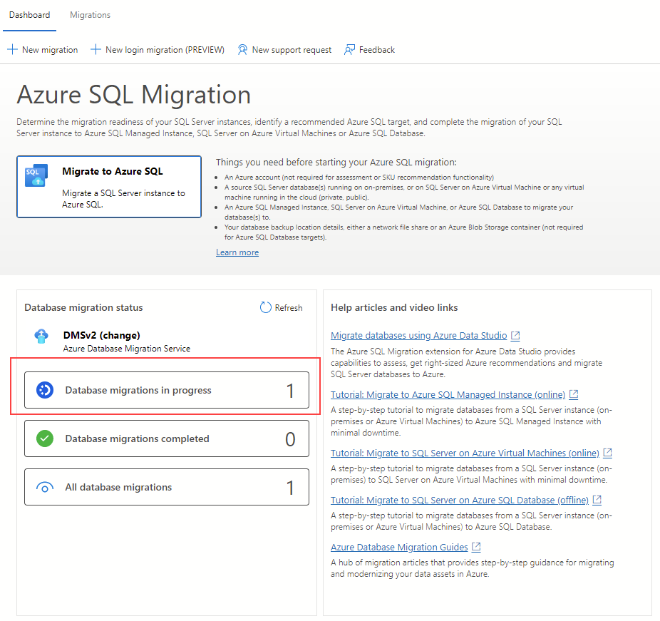
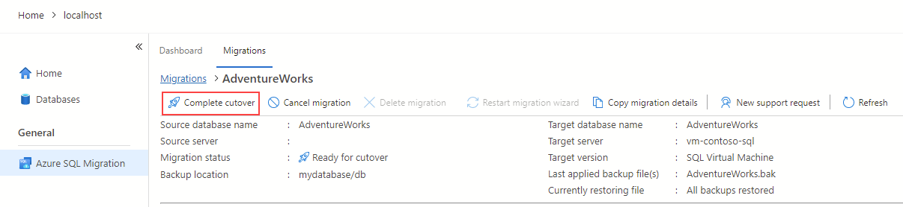

---
lab:
    title: 'Migrate SQL Server databases to SQL Server on Azure Virtual Machine'
---

# Migrate SQL Server databases to SQL Server on Azure Virtual Machine

With the Azure OpenAI Service, developers can create chatbots, language models, and other applications that excel at understanding natural human language. The Azure OpenAI provides access to pre-trained AI models, as well as a suite of APIs and tools for customizing and fine-tuning these models to meet the specific requirements of your application. 

In this exercise, you'll learn how to deploy a model in Azure OpenAI and use it in your own application to summarize text.

In this exercise, you'll learn how to migrate a SQL Server database to a SQL Server running on an Azure Virtual Machine using the Azure migration extension for Azure Data Studio. You'll start by installing and launching the Azure migration extension for Azure Data Studio. Then, you'll perform an online migration of a SQL Server database to a SQL Server running on an Azure Virtual Machine. You'll also learn how to monitor the migration process on the Azure portal and complete the cutover process to finalize the migration.

This exercise will take approximately **30** minutes.

## Before you start

You'll need an Azure subscription and a SQL Server on Azure Virtual Machine resource.

- To sign up for a free Azure subscription, visit [https://azure.microsoft.com/free](https://azure.microsoft.com/free).
- To review the steps to provision a SQL Server on Azure Virtual Machine, visit [Quickstart: Create SQL Server on a Windows virtual machine in the Azure portal](https://learn.microsoft.com/azure/azure-sql/virtual-machines/windows/sql-vm-create-portal-quickstart).

## Install and launch the Azure migration extension for Azure Data Studio

Before start using the Azure migration extension, you need to install [Azure Data Studio](https://learn.microsoft.com/sql/azure-data-studio/download-azure-data-studio) first. The extension is available in Azure Data Studio marketplace.

To install the migration extension, follow these steps:

1. Open the extensions manager in Azure Data Studio.
1. Search for ***Azure SQL Migration*** and select the extension.
1. Install the extension. Once you install it, you'll find the Azure SQL Migration extension in the list of installed extensions.
1. Connect to a SQL Server instance in Azure Data Studio.
1. Right-click on the instance name and select **Manage** to access the dashboard and the landing page of the Azure SQL Migration extension.

## Perform an online migration of a SQL Server database to a SQL Server running on an Azure Virtual Machine

To perform a minimal downtime migration using Azure Data Studio, follow these steps:

1. Launch the Migrate to Azure SQL wizard within the extension in Azure Data Studio.

1. On **Step 1: Databases for assessment**, select the database you want to migrate, then select **Next**.
    >[!TIP]
    > It's recommended to collect performance data and get right-sized Azure recommendations.

1. On **Step 2: Assessment results and recommendations**, wait for the assessment to complete, then select **SQL Server on Azure Virtual Machine** as the **Azure SQL** target.

1. At the bottom of the **Step 2: Assessment results and recommendations** page, select **View/Select** to view the assessment results. Select the database to migrate. 

    >[!TIP]
    > Take a moment to review the assessment results on the right side.

1. On **Step 3: Azure SQL target**, select an Azure account and your target SQL Server on Azure Virtual Machine.

    

1. On **Step 4: Azure Database Migration Service**, create a new Azure Database Migration Service using the Azure Data Studio wizard. If you have previously created one, you can reuse it. Alternatively, you can create an Azure Database Migration Service resource through the Azure portal.

    >[!IMPORTANT]
    > Make sure the subscription is registered to use the **Microsoft.DataMigration** namespace. 
    >
    > To learn how to perform a resource provider registration, see [Register the resource provider](https://learn.microsoft.com/azure/dms/quickstart-create-data-migration-service-portal#register-the-resource-provider).

1. On **Step 5: Data source configuration**, select the location of your database backups, either on an on-premises network share or in an Azure Blob Storage container.

1. Start the database migration and monitor the progress in Azure Data Studio. You can also track the progress in the Azure portal under the Azure Database Migration Service resource.

1. Select **Database migrations in progress** in the migration dashboard to view ongoing migrations. 

    

1. Select the database name to get further details.

    

## Monitor migration on Azure portal

1. Alternatively, you can also monitor the migration activity using Azure Database Migration Service. 

    
    
## Complete the cutover process

1. Stop all incoming transactions to the source database.

1. Take any [tail log backups](https://learn.microsoft.com/sql/relational-databases/backup-restore/tail-log-backups-sql-server) for the source database in the specified backup location.

1. Select **Complete cutover** in the monitoring page.

    

1. Verify that all log backups have been restored on the target database. The **Log backups pending restore** value should be zero. This step will complete the migration.

    

1. The migration status property will change to **Completing**, then to **Succeeded** after the migration is completed.

    >[!NOTE]
    > You can complete the cutover using similar steps with Azure Database Migration Service through the Azure portal.

1. Make application configuration changes to point to the new database running on Azure Virtual Machine.

## Clean up

When you're working in your own subscription, it's a good idea at the end of a project to identify whether you still need the resources you created. 

Leaving resources running unnecessarily can result in additional costs. You can delete resources individually or delete the entire set of resources in the [Azure portal](https://portal.azure.com?azure-portal=true).

## More information

For more information about SQL Server on Windows Azure Virtual Machines, see [What is SQL Server on Windows Azure Virtual Machines?](https://learn.microsoft.com/en-us/azure/azure-sql/virtual-machines/windows/sql-server-on-azure-vm-iaas-what-is-overview?view=azuresql-vm).
