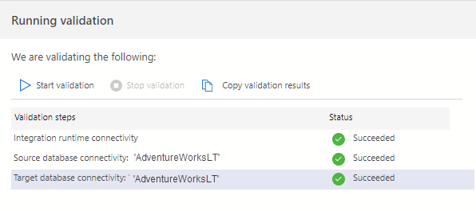
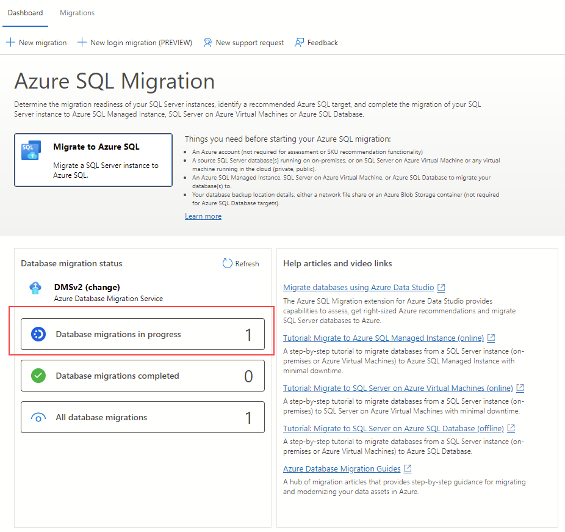
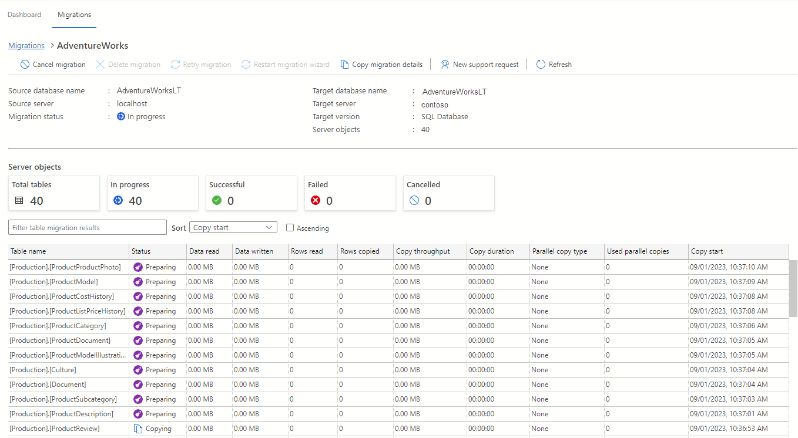

---
lab:
    title: 'Migrate SQL Server databases to Azure SQL Database'
---

# Migrate SQL Server databases to Azure SQL Database

In this exercise, you'll learn how to migrate a SQL Server database to Azure SQL Database using the Azure migration extension for Azure Data Studio. You'll start by installing and launching the Azure migration extension for Azure Data Studio. Then, you'll perform an offline migration of a SQL Server database to Azure SQL Database. You'll also learn how to monitor the migration process on the Azure portal.

This exercise takes approximately **45** minutes.

> **Note**: To complete this exercise, you need access to an Azure subscription to create Azure resources. If you don't have an Azure subscription, create a [free account](https://azure.microsoft.com/free/?azure-portal=true) before you begin.

## Before you start

To run this exercise, you need:

| Item | Description |
| --- | --- |
| **Target server** | An Azure SQL Database server. We'll create it during this exercise.|
| **Target database** | A database on Azure SQL Database server. We'll create it during this exercise.|
| **Source server** | An instance of SQL Server 2019 or a [newer version](https://www.microsoft.com/en-us/sql-server/sql-server-downloads) installed on a server of your preference. |
| **Source database** | The lightweight [AdventureWorks](https://learn.microsoft.com/sql/samples/adventureworks-install-configure) database to be restored on the SQL Server instance. |
| **Azure Data Studio** | Install [Azure Data Studio](https://learn.microsoft.com/sql/azure-data-studio/download-azure-data-studio) in the same server where the source database is located. If it's already installed, update it to make sure that you’re using the most recent version. |
| **Microsoft.DataMigration** resource provider | Make sure the subscription is registered to use the **Microsoft.DataMigration** namespace. To learn how to perform a resource provider registration, see [Register the resource provider](https://learn.microsoft.com/azure/dms/quickstart-create-data-migration-service-portal#register-the-resource-provider). |
| **Microsoft Integration runtime** | Install [Microsoft Integration Runtime](https://aka.ms/sql-migration-shir-download). |

## Restore a SQL Server database

Let's restore the *AdventureWorksLT* database on the SQL Server instance. This database will serve as the source database for this lab exercise. You can skip these steps if the database is already restored.

1. Select the Windows Start button and type SSMS. Select **Microsoft SQL Server Management Studio 18** from the list.  

1. When SSMS opens, notice that the **Connect to Server** dialog will be pre-populated with the default instance name. Select **Connect**.

1. Select the **Databases** folder, and then **New Query**.

1. In the new query window, copy and paste the below T-SQL into it. Ensure that the database backup file name and path match your actual backup file. If they don’t, the command will fail. Execute the query to restore the database.

    ```sql
    RESTORE DATABASE AdventureWorksLT
    FROM DISK = 'C:\<FolderName>\AdventureWorksLT2019.bak'
    WITH RECOVERY,
          MOVE 'AdventureWorksLT2019_Data' 
            TO 'C:\<FolderName>\AdventureWorksLT2019.mdf',
          MOVE 'AdventureWorksLT2019_Log'
            TO 'C:\<FolderName>\AdventureWorksLT2019.ldf';
    ```

    > **Note**: Make sure you have the lightweight [AdventureWorks](https://learn.microsoft.com/sql/samples/adventureworks-install-configure#download-backup-files) backup file on the SQL Server machine before running the T-SQL command.

1. You should see a successful message after the restore is complete.

## Register Microsoft.DataMigration namespace

Skip these steps if the **Microsoft.DataMigration** namespace is already registered on your subscription.

1. From the Azure portal, search for **Subscription** in the search box at the top, then select **Subscriptions**. Select your subscription on the **Subscriptions** blade.

1. On your subscription page, select **Resource providers** under **Settings**. Search for **Microsoft.DataMigration** in the search box at the top, then select **Microsoft.DataMigration**. 

    > **Note**: If the **Resource Provider Details** side bar opens, you can close it.

1. Select **Register**.

## Provision an Azure SQL Database

Let's set up an Azure SQL Database that will serve as our target environment.

1. From the Azure portal, search for **SQL databases** in the search box at the top, then select **SQL databases**.

1. On the **SQL databases** blade, select **+ Create**.

1. On the **Create SQL Database** page, select the following options.

    - **Subscription:** &lt;Your subscription&gt;
    - **Resource group:** &lt;Your resource group&gt;
    - **Database name:** AdventureWorksLT
    - **Server:** Select the **Create new** link. Provide the server details on the **Create SQL Database Server** page.
        - **Server name:** &lt;Choose a server name&gt;. Server name must be globally unique.
        - **Location:** &lt;Your region, same as your resource group&gt;
        - **Authentication method:** Use SQL authentication
        - **Server admin login:** sqladmin
        - **Password:** &lt;Your password&gt;
        - **Confirm password:** &lt;Your password&gt;
        
            **Note:** Make note of this server name, and credentials. You'll use it in subsequent tasks.

    - **Want to use SQL elastic pool?** No
    - **Workload environment:** Production

1. On **Compute + storage**, select **Configure database**. On the **Configure** page, for **Service tier** dropdown, select **Basic**, and then **Apply**.

1. For the **Backup storage redundancy** option, keep the default value: **Geo-redundant backup storage**. Select **Review + Create**.

1. Review the settings, then select **Create**.

1. Once the deployment is complete, select **Go to resource**.

## Enable access to an Azure SQL Database

Let's enable access to Azure SQL Database so we can connect to it through the client tools.

1. From the **SQL database** page, select the **Overview** section, and then select the link for the server name in the top section:

1. On the **SQL server** blade, select **Networking** under the **Security** section.

1. On the **Public access** tab, select **Selected networks**. 

1. In **Firewall rules**, select **+ Add your client IPv4 address**.

1. On **Exceptions**, check the **Allow Azure services and resources to access this server** property. 

1. Select **Save**.

## Connect to Azure SQL Database in Azure Data Studio

Before start using the Azure migration extension, let's connect to the target database.

1. Launch Azure Data Studio.

1. Select **Connections**, then **Add Connection**.

1. Fill out the **Connection Details** fields with the SQL Server name and other information.

    > **Note**: Enter the name of the SQL Server created previously. The format should be in the format of **<server>.database.windows.net**.

1. In the **Authentication type**, select **SQL Login** and provide the user name and password.

1. Select **Connect**.

## Install and launch the Azure migration extension for Azure Data Studio

Follow these steps to install the migration extension. If the extension is already installed, you can skip these steps.

1. Open the extensions manager in Azure Data Studio.

1. Search for ***Azure SQL Migration*** and select the extension.

1. Install the extension. Once you install it, the Azure SQL Migration extension is in the list of installed extensions.

1. Connect to a SQL Server instance in Azure Data Studio. In the new connection tab, select **Optional (False)** for the **Encrypt** option.

1. To launch the Azure migration extension, right-click on the SQL Server instance name and select **Manage** to access the dashboard and the landing page of the Azure SQL Migration extension.

    > **Note**: If **Azure SQL Migration** isn't visible in the server dashboard side bar, reopen Azure Data Studio.
 
## Perform an offline migration of a SQL Server database to Azure SQL Database

We’re now ready to migrate the data. Follow these steps to perform an offline migration using Azure Data Studio.

1. Launch the **Migrate to Azure SQL** wizard within the extension in Azure Data Studio, and then select **Migrate to Azure SQL**.

1. On **Step 1: Databases for assessment**, select the *AdventureWorks* database, then select **Next**.

1. On **Step 2: Assessment summary and SKU recommendations**, wait for the assessment to complete, and review the results. Select **Next**.

1. On **Step 3: Target platform and & assessment results**, select the database to see the assessment findings.

    > **Note**: Take a moment to review the assessment results on the right side.

1. At the top of the **Step 3: Target platform and & assessment results** page, select **Azure SQL Database** as the **Azure SQL** target.

1. On **Step 4: Azure SQL target**, if the account isn't linked yet, make sure you add an account selecting the **Link account** link. Then, select an Azure account, AD tenant, subscription, location, resource group, Azure SQL Database server, and credentials of the Azure SQL Database.

1. Select **Connect**, and then select the *AdventureWorks* database as **Target database**. Select **Next**.

1. On **Step 5: Azure Database Migration Service**, select the **Create new** link to create a new Azure Database Migration Service using the wizard. Follow the steps provided by the wizard to set up a new self-hosted integration runtime. If you have previously created one, you can reuse it.

1. On **Step 6: Data source configuration**, enter the credentials to connect to the SQL Server instance from the self-hosted integration runtime. 

1. Select all the tables to migrate from source to target, then check the **Migrate missing schema** option.

1. Select **Run validation**.

     

1. After the validation completes, select **Next**.

1. On **Step 7: Summary**, select **Start migration**.

1. Select **Database migrations in progress** in the migration dashboard to view the migration status. 

    

1. Select the *AdventureWorks* database name to see more details.

    

1. After the status is **Succeeded**, navigate to the target server, and validate the target database. Check the database schema and the migrated data.

You've learned how to install the migration extension, and generate the schema of the database using Data Migration Assistant. You’ve also learned how to migrate a SQL Server database to an Azure SQL Database using the Azure migration extension for Azure Data Studio. Once migration is complete, you can start using your new Azure SQL Database resource. 

## Clean up

When you're working in your own subscription, it's a good idea at the end of a project to identify whether you still need the resources you created. 

Leaving resources running unnecessarily can result in extra costs. You can delete resources individually or delete the entire set of resources in the [Azure portal](https://portal.azure.com?azure-portal=true).

## More information

For more information about Azure SQL Database, see [What is Azure SQL Database](https://learn.microsoft.com/en-us/azure/azure-sql/database/sql-database-paas-overview).
