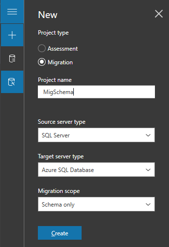
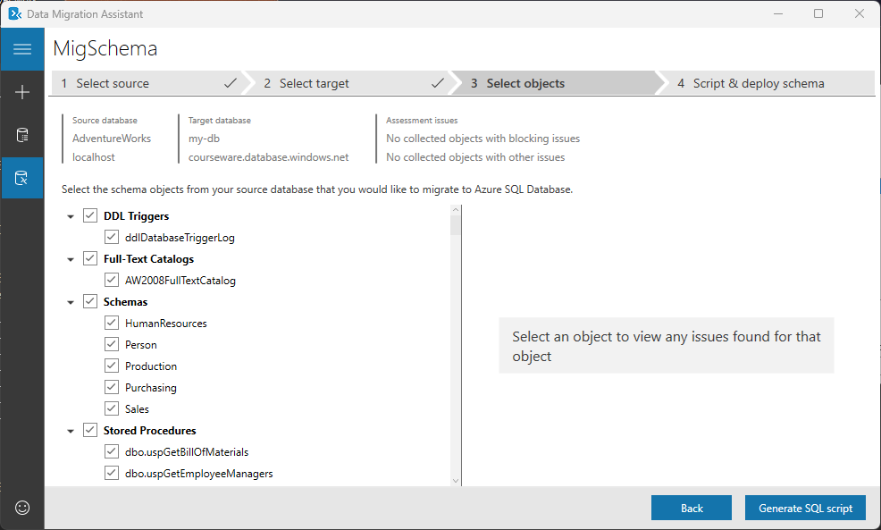
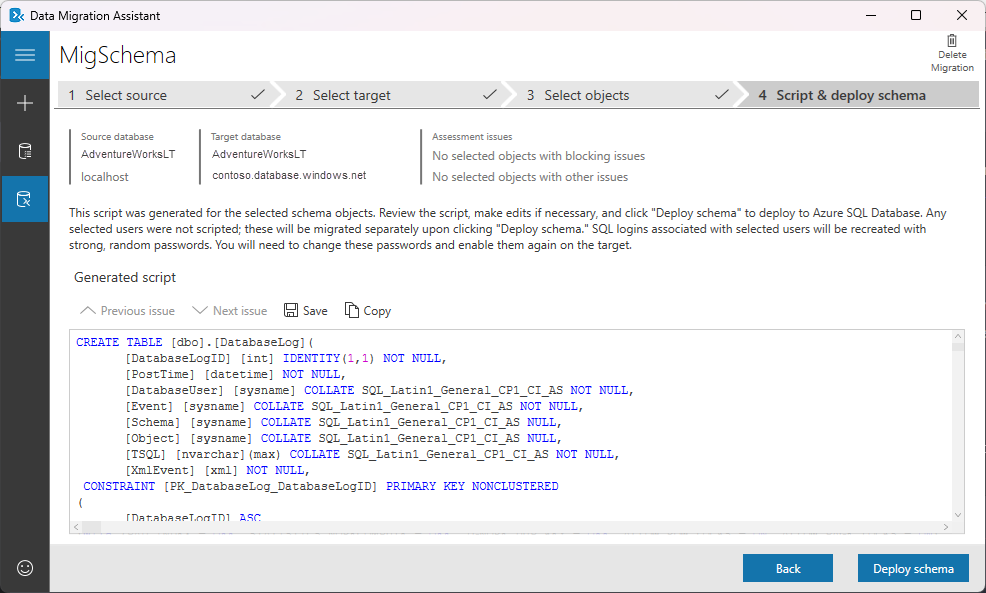

---
lab:
    title: 'Migrate SQL Server databases to Azure SQL Database'
---

# Migrate SQL Server databases to Azure SQL Database

In this exercise, you'll learn how to migrate a SQL Server database to Azure SQL Database using the Azure migration extension for Azure Data Studio. You'll start by installing and launching the Azure migration extension for Azure Data Studio. Then, you'll perform an offline migration of a SQL Server database to Azure SQL Database. You'll also learn how to monitor the migration process on the Azure portal.

This exercise takes approximately **45** minutes.

> **Note**: To complete this exercise, you need access to an Azure subscription to create Azure resources. If you don't have an Azure subscription, create a [free account](https://azure.microsoft.com/free/?azure-portal=true) before you begin.

## Before you start

To run this exercise, you need:

| Item | Description |
| --- | --- |
| **Target Server** | An Azure SQL Database server.|
| **Target Database** | A database on Azure SQL Database server.|
| **Source Server** | The latest [SQL Server](https://www.microsoft.com/en-us/sql-server/sql-server-downloads) version installed on a server of your choice. |
| **Source Database** | The lightweight [AdventureWorks](https://learn.microsoft.com/sql/samples/adventureworks-install-configure) database to be restored on the latest SQL Server instance. |
| **Azure Data Studio** | For this exercise, install [Azure Data Studio](https://learn.microsoft.com/sql/azure-data-studio/download-azure-data-studio) in the same server where the source database is located. If it's already installed, make sure that you’re using the most recent version.|
| **Data Migration Assistant** | For this exercise, install [Data Migration Assistant](https://learn.microsoft.com/sql/azure-data-studio/download-azure-data-studio) in the same server where the source database is located. |
| **Microsoft.DataMigration** resource provider | Make sure the subscription is registered to use the **Microsoft.DataMigration** namespace. To learn how to perform a resource provider registration, see [Register the resource provider](https://learn.microsoft.com/azure/dms/quickstart-create-data-migration-service-portal#register-the-resource-provider). |

## Provision an Azure SQL Database

Let's set up an Azure SQL Database that will serve as our target environment.

1. From the Azure portal, search for **SQL databases** in the search box at the top, then select **SQL databases**.

1. On the **SQL databases** blade, select **+ Create**.

1. On the **Create SQL Database** page, select the following options on the **Basics** tab, and then select **OK**.

    - **Subscription:** &lt;Your subscription&gt;
    - **Resource group:** &lt;Your resource group&gt;
    - **Database Name:** AdventureWorksLT
    - **Server:** Select **Create new**. Provide the server details on the **Create SQL Database Server** page.
        - **Server name:** &lt;Choose a server name&gt;. Server name must be globally unique.
        - **Location:** &lt;Your region, same as your resource group&gt;
        - **Authentication method:** Use SQL authentication
        - **Server admin login:** sqladmin
        - **Password:** &lt;Your password&gt;
        - **Confirm password:** &lt;Your password&gt;

1. Back to the **Create SQL Database** page, make sure **Want to use Elastic Pool?** is set to **No**. 

1. On the **Compute + Storage** option, Select **Configure database**. On the **Configure** page, for **Service tier** dropdown, select **Basic**, and then **Apply**.

    **Note:** Make note of this server name, and your sign in information. You'll use it in subsequent tasks.

1. For the **Backup storage redundancy** option, keep the default value: **Geo-redundant backup storage**. Select **Next: Networking**.

1. On the **Networking** tab, for **Network Connectivity** option, select **Private endpoint**. Select the **+ Add private endpoint** link under the **Private endpoints** option.

1. Complete the **Create private endpoint** right pane as follows:

    - **Subscription:** &lt;Your subscription&gt;
    - **Resource group:** &lt;Your resource group&gt;
    - **Location:** &lt;Your region, same as your resource group&gt;
    - **Name:** SQL-Endpoint
    - **Target sub-resource:** SqlServer
    - **Virtual network:** lab02-vnet
    - **Subnet:** lab02-vnet/default (10.x.0.0/24)
    - **Integrate with private DNS zone:** Yes
    - **Private DNS zone:** keep the default value
    - Review the settings, and then select **OK**  

1. The new endpoint appears on the **Private endpoints** list.

1. Select **Next: Security**, and then **Next: Additional settings**.  

1. On the **Additional settings** page, select **Review + Create**.

1. Review the settings, then select **Create**.

1. Once the deployment is complete, select **Go to resource**.

## Enable access to an Azure SQL Database

Let's enable access to Azure SQL Database

1. From the **SQL database** page, select the **Overview** section, and then select the link for the server name in the top section:

1. On the SQL servers navigation blade, select **Networking** under the **Security** section.

1. On the **Public access** tab, select **Selected networks**, and then check the **Allow Azure services and resources to access this server** property. Select **Save**.

## Connect to Azure SQL Database in Azure Data Studio

Before start using the Azure migration extension, let's connect to the target database.

1. Launch Azure Data Studio.

1. Select **Connections**, then **Add Connection**.

1. Fill out **Connection Details** with the SQL Server name and other information.

    > **Note**: Enter the name of the SQL Server created previously. It should follow **<server>.database.windows.net**

## Install and launch the Azure migration extension for Azure Data Studio

Follow the steps to install the migration extension.

1. Open the extensions manager in Azure Data Studio.

1. Search for ***Azure SQL Migration*** and select the extension.

1. Install the extension. Once you install it, the Azure SQL Migration extension is in the list of installed extensions.

1. Connect to a SQL Server instance in Azure Data Studio. In the new connection tab, select **Optional (False)** for the **Encrypt** option.

1. To launch the Azure migration extension, right-click on the source instance name and select **Manage** to access the dashboard and the landing page of the Azure SQL Migration extension.

    > **Note**: If the **Azure SQL Migration** option isn't visible in the dashboard side bar, reopen Azure Data Studio.
 
## Generate the database schema with DMA

Before we begin the migration, we need to make sure the schema exists at the target database. We use DMA to create the schema from the source and apply it to the target.

1. Launch Data Migration Assistant.

1. Create a new migration project, set the source type to **SQL Server**,  the target server type to **Azure SQL Database**, and migration scope to **Schema only**. Select **Create**.

     

1. On the **Select source** tab, enter the name of the source SQL Server instance, and select the **Authentication type** supported by the source SQL Server instance. Select **Connect**. 

1. Select a database to migrate to Azure SQL Database, and then select **Next**.

1. On the **Select target** tab, enter the name of the source SQL Server instance, and select the **Authentication type** supported by the source SQL Server instance. Select **Connect**. 

1. Select a target database, and then select **Next**.

1. On the **Select objects** tab, select the schema objects from the source database that you want to generate the script. Select **Generate SQL script**. 

    

1. Review and adjust the script for objects that can't be created at the target in their current state.
 
1. You can execute the script manually using Azure Data Studio, SQL Management Studio, or by selecting **Deploy schema**.

    

## Perform an offline migration of a SQL Server database to Azure SQL Database

Follow the steps to perform an offline migration using Azure Data Studio.

1. Launch the Migrate to Azure SQL wizard within the extension in Azure Data Studio, and then select **Migrate to Azure SQL**.

1. On **Step 1: Databases for assessment**, select the `AdventureWorksLT` database, then select **Next**.

1. On **Step 2: Assessment results and recommendations**, wait for the assessment to complete, then select **Azure SQL Database** as the **Azure SQL** target.

1. At the bottom of the **Step 2: Assessment results and recommendations** page, select **View/Select** to view the assessment results. Select the database to migrate.

    > **Note**: Take a moment to review the assessment results on the right side.

1. On **Step 3: Azure SQL target**, select an Azure account, AD tenant, subscription, location, resource group, Azure SQL Database server, and credentials of the Azure SQL Database created in the previous task. 

1. Select **Connect**, and then select the **Target database**. Select **Next**.

1. On **Step 4: Azure Database Migration Service**, create a new Azure Database Migration Service using the Azure Data Studio wizard. If you have previously created one, you can reuse it. Make sure you follow the steps provided by the wizard to set up the self-hosted integration runtime.

1. On **Step 5: Data source configuration**, enter the credentials to connect to the SQL Server instance from the self-hosted integration runtime. Select all the tables to migrate from source to target. Select **Run validation**.

     

1. On **Step 6: Summary**, select **Start migration**.

1. Select **Database migrations in progress** in the migration dashboard to view the migration in progress. 

    

1. Select the database name to get further details.

    

1. After the status is **Succeeded**, navigate to the target server, and validate the target database. Check the database schema and the migrated data.

You've learned how to install the migration extension, and generate the schema of the database using Data Migration Assistant. You’ve also learned how to migrate a SQL Server database to an Azure SQL Database using the Azure migration extension for Azure Data Studio. Once migration is complete, you can start using your new Azure SQL Database resource. 

## Clean up

When you're working in your own subscription, it's a good idea at the end of a project to identify whether you still need the resources you created. 

Leaving resources running unnecessarily can result in extra costs. You can delete resources individually or delete the entire set of resources in the [Azure portal](https://portal.azure.com?azure-portal=true).

## More information

For more information about Azure SQL Database, see [What is Azure SQL Database](https://learn.microsoft.com/en-us/azure/azure-sql/database/sql-database-paas-overview).
