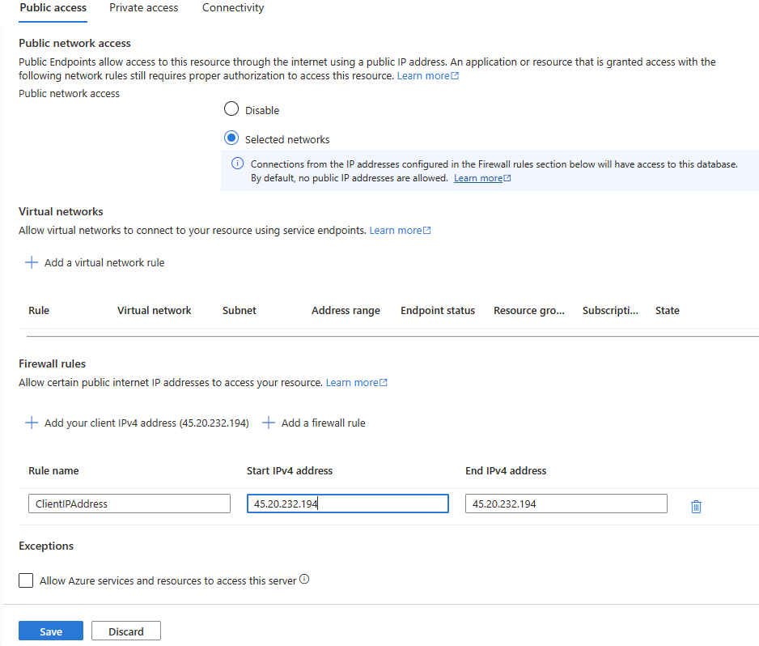

---
lab:
    title: 'Configure geo-replication for Azure SQL Database'
---

# Configure geo-replication for Azure SQL Database

**Estimated Time: 30 minutes**

In this exercise, you’ll learn how to enable geo-replication for an Azure SQL Database and perform a failover to a secondary region. This involves creating a replica of your database, setting up a new server for the secondary database, and initiating a forced failover. You’ll also learn how to check the status of your deployments and understand the role of geo-secondaries or geo-replicas in Azure SQL Database management. Finally, you’ll manually fail over the database to another region using the Azure portal. This exercise provides hands-on experience with key aspects of managing and ensuring the resilience of your Azure SQL Databases.

This exercise takes approximately **45** minutes.

> **Note**: To complete this exercise, you need access to an Azure subscription to create Azure resources. If you don't have an Azure subscription, create a [free account](https://azure.microsoft.com/free/?azure-portal=true) before you begin.

## Before you start

To complete this exercise, we’ll be using many resources and tools. Let’s take a closer look at each one:

|  | Description |
| --- | --- |
| **Primary server** | An Azure SQL Database server that we’ll set up in this lab.|
| **Primary database** | The **AdventureWorksLT** sample database created on the secondary server.|
| **Secondary server** | An extra Azure SQL Database server that we’ll set up in this lab. |
| **Secondary database** | This is our database replica on the secondary server. |
| **SQL Server Management Studio** | Download and install the latest [SQL Server Management Studio](https://learn.microsoft.com/sql/ssms/download-sql-server-management-studio-ssms) in a machine of your choice. |

## Provision Azure SQL Database resources

Let's create the Azure SQL Database resources in two steps. First, we’ll establish the primary server and database. Then, we’ll repeat the process to set up the secondary server with a different name. This results in two Azure SQL servers, each with its own firewall rules. However, only the primary server has a database.

1. Navigate to the [Azure portal](https://portal.azure.com), and sign in with your Azure account credentials.
1. Select the **Cloud Shell** option on the top-right menu bar (it looks like a shell prompt **`>_`**).
1. A pane slides up from the bottom asking you to choose your preferred shell type. Select **Bash**.
1. If this is your first time opening **Cloud Shell**, you'll be prompted to create a storage account (used to persist your data across sessions). Follow the prompts to create one.
1. After the shell initiates, you'll have a command-line interface right within the Azure portal where you can enter your script commands.
1. Select **{}** to open the editor and copy and paste the script below. 
 
    > **Note**: Remember to replace the placeholder values in the script with your actual values before running it. If you need to edit the script, type `code` in the **Cloud Shell** to use the built-in text editor.
        
    ```powershell
    subscription="<Your subscription>"
    resourceGroup="<Your resource group>"
    location="<Your region, same as your resource group>"
    serverName="<Your SQL server name>"
    adminLogin="sqladmin"
    password="<password>"
    databaseName="AdventureWorksLT"
    
    az account set --subscription $subscription
    az sql server create --name $serverName --resource-group $resourceGroup --location $location --admin-user $adminLogin --admin-password $password
    az sql db create --resource-group $resourceGroup --server $serverName --name $databaseName --sample-name AdventureWorksLT --service-objective Basic

    ```
    This Azure CLI script sets the active Azure subscription, creates a new Azure SQL server, and then creates a new Azure SQL Database populated with the AdventureWorksLT sample data.

1. Right click on the editor page, and select **Save**.
1. Provide a name for the file. The file extension should be **.ps1**.
1. On the Cloud Shell terminal, type and execute the command.

    ```bash
    chmod +x <script_name>.ps1

    ```
    
    Replace *<script_name>* to reflect the name you provided for script. This command  changes the permissions of the file you created to make it executable.
1. Execute the script. 
    
    ```powershell
    ./<script_name>.ps1

    ```
1. Once the process is complete, navigate to the newly created Azure SQL server by going to the Azure portal and navigating to the page for your SQL server. 
1. In your Azure SQL server main page, select **Networking** on the left.
1. In the **Public access** tab, select **Selected networks**.
1. In the **Firewall rules** section, select **+ Add your client IPv4 address**. Type your IP address then select **Save**.

    

    At this point, you should be able to connect to the primary `AdventureWorksLT` database through a client tool like SQL Management Studio.
1. Now, let's create a secondary Azure SQL server. Repeat the previous steps (6-14), but make sure to use a different `serverName` and `location`. Also, skip the code that creates the database by commenting out the `az sql db create` command. This results in a new server in a different region without the sample database.

## Enable geo-replication

Now, let's create the secondary replica for our Azure SQL resources.

1. In the Azure portal, navigate to your database by searching for **SQL databases**.
1. Select the SQL database **AdventureWorksLT**.
1. In your Azure SQL database main page, select **Replicas** under **Data management** on the left.
1. Select **+ Create replica**.
1. On the **Create SQL Database - Geo Replica** page and under **Server**, select the new secondary SQL server created previously.
1. Select **Review + Create**, then select **Create**. The secondary database will now be created, and seeded. To check the status, look under the notification icon at the top of the Azure portal. 
1. If successful, it will progress from **Deployment in progress** to **Deployment succeeded**.
1. Connect to your secondary Azure SQL server using SQL Management Studio.

## Fail over an SQL database to a secondary region

Imagine a scenario where the primary Azure SQL Database is experiencing issues due to a regional outage. To ensure the continuity of your services and minimize downtime, you would need to perform a forced failover.

A forced failover switches the roles of your primary and secondary databases. The secondary database takes over as the primary database, and the original primary database becomes the secondary one. This allows your applications to continue operating using the secondary replica while the issues with the original primary database are being resolved.

Let's learn how to initiate a forced failover in response to a region outage.

1. Navigate to the SQL servers page, and select the secondary server.
1. In the **Settings** section on the left, select **SQL databases**.
1. In your Azure SQL database main page, select **Replicas** under **Data management** on the left. The geo replication link is now established.
1. Select the **...** menu for the secondary server, and select **Forced Failover**.

    > **Note**: Forced failover will switch the secondary database to the primary role. All sessions are disconnected during this operation.
1. When prompted by the warning message, select **Yes**.
1. The status of the primary replica switches to **Pending** and the secondary to **Failover**. 

    > **Note**:  This operation might take a few minutes. Once it's done, the roles will reverse: the secondary server will become the new primary server, and the original primary server will turn into the secondary one.

Consider why you might want to place your primary and secondary SQL servers in the same region, and when it could be beneficial to choose different regions.

You have now seen how to enable geo-replicas for Azure SQL Database, and manually fail it over to another region using the Azure portal.

## Clean up

When you're working in your own subscription, it's a good idea at the end of a project to identify whether you still need the resources you created. 

Leaving resources running unnecessarily can result in extra costs. You can delete resources individually or delete the entire set of resources in the [Azure portal](https://portal.azure.com?azure-portal=true).

## More information

For more information about geo-replication for Azure SQL Database, see [Active geo-replication](https://review.learn.microsoft.com/azure/azure-sql/database/active-geo-replication-overview).